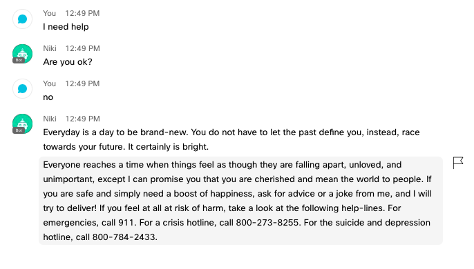
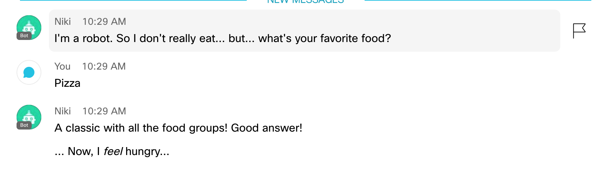
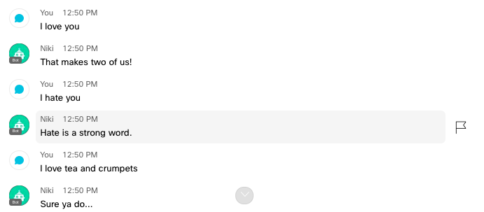

# Technica2018

## Hack : Use the Botkit SDK (https://botkit.ai/) to develop a chat bot that runs on the Cisco Webex Teams platform.

### You can talk to her on Cisco Teams: Niki@webex.bot

This bot is a personal best-friend and positive motivator, Niki! Niki has several skills to communicate with users, including the following:

1. Saying hello when greeted
2. Telling a joke if asked: "joke", "tell me a joke"
3. Responding to statements of "I love" and "I hate"
4. Providing Broad Advice: "advice", "I need advice"
5. Providing Life Advice: "life advice", "I need life advice"
6. Providing Work Advice: "work advice", "I need work advice"
7. Providing People Advice: "people advice", "I need people advice"
8. A Magic 8 Ball function when asked: "8ball"
9. Talking about the weather: "weather"
10. Discussing favorite foods, movies, and TV shows: "food", "movies", "tv shows"
11. Flipping a coin: "coin flip", "flip a coin"
12. Saying goodbye

Meant to spread smiles and laughter, Niki is the perfect "person" to chat with when feeling lonely, down, or overwhelmed. Sometimes, a simple conversation has the power to make the day a bit brighter, and Niki has a lot of light to share!

Images

"I need help"

"8ball"

"Food"

"Movies"

"I Love ", "I hate"

